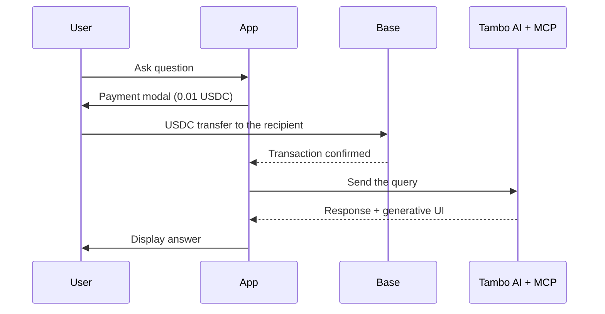

<p align="center">
  
</p>

<p align="center">
  <strong>Star us&nbsp;-&gt;</strong>&nbsp;&nbsp;
  <a href="https://github.com/aaronjmars/tweazy/stargazers"></a>&nbsp;&nbsp;
  <a href="https://www.youtube.com/watch?v=DNMeMPvgTQk"></a>&nbsp;&nbsp;
  <a href="https://x.com/aaronjmars"></a>
</p>

<p align="center">
  <strong>The best way to read tweets onchain.</strong><br>
  A pay-per-use AI chat app - users pay 0.01 USDC on Base for every query, with Coinbase Smart Wallets (passkeys) or any browser wallet, and MCP servers for tools and data.
</p>

<div align="center">

[](https://github.com/aaronjmars/tweazy/stargazers)
[](https://github.com/aaronjmars/tweazy/network/members)
[](https://github.com/coinbase/x402)
[](https://base.org)
[](../LICENSE)

</div>

## See it in action

[](https://www.youtube.com/watch?v=DNMeMPvgTQk)

## What it does

Tweazy is a Next.js template for a **pay-per-use AI app**:

1. **Connect a wallet** - a Coinbase Smart Wallet with passkeys, or any injected browser wallet (MetaMask, Rabby, Coinbase Wallet, ...).
2. **Ask a question** in the chat.
3. **Pay 0.01 USDC** on Base. Every query opens a payment step first; the message is only sent after the USDC transfer goes through.
4. **Get the answer**, rendered with generative UI (charts and data cards) by [Tambo AI](https://tambo.co).
5. **Add your own MCP servers** at `/mcp-config` (for example a Twitter/X data server) so the AI can call their tools.

Use it as a starting point for monetized AI apps with onchain payments.

## Features

- **Two wallet options**: Coinbase Smart Wallet (passkeys, no seed phrase) or any injected wallet via wagmi.
- **Per-query USDC payments** on Base, set in `src/lib/config.ts` (0.01 USDC by default).
- **Tambo AI** generative UI with a React component registry (`src/lib/tambo.ts`).
- **MCP support**: user-configured MCP servers (HTTP or SSE), stored in the browser.
- **Base Sepolia by default**, Base mainnet with one env var.

## Quick start

### Prerequisites

- Node.js 24+ (see `.nvmrc`) and npm
- A [Tambo AI API key](https://tambo.co/dashboard)
- A wallet address to receive payments

### Setup

```bash
git clone https://github.com/aaronjmars/tweazy
cd tweazy
npm install
cp example.env.local .env.local   # then fill in the values below
npm run dev
```

Open [http://localhost:3000](http://localhost:3000).

### Scripts

```bash
npm run dev            # dev server
npm run build          # production build
npm run start          # serve the production build
npm run lint           # eslint
npm run format:check   # biome (npm run format to fix)
npm run init           # npx tambo init
```

## Configuration

Secrets go in `.env.local`. Everything else (RPC URLs, USDC contracts, chain IDs, price) lives in `src/lib/config.ts`.

| Var | Required | Notes |
|---|---|---|
| `NEXT_PUBLIC_TAMBO_API_KEY` | yes | Tambo AI API key. |
| `NEXT_PUBLIC_PAYMENT_RECIPIENT` | yes | Wallet address that receives the 0.01 USDC payments. |
| `NEXT_PUBLIC_NETWORK_MODE` | no | `testnet` (default, Base Sepolia) or `mainnet` (Base). |
| `CDP_API_KEY_NAME`, `CDP_API_KEY_PRIVATE_KEY`, `CDP_WALLET_SECRET` | no | Coinbase CDP credentials for the `/api/cdp/*` routes. Without them, create-wallet, balance and fund-wallet return mock data. |
| `TWEAZY_ALLOW_MOCK_PAYMENT` | no | Set to `1` to let `/api/cdp/transfer` return a mock success when CDP is not configured. Local development only - never on a deployment that serves paid queries. |

### Networks

| Mode | Network | Chain ID | USDC contract |
|---|---|---|---|
| `testnet` (default) | Base Sepolia | 84532 | `0x036CbD53842c5426634e7929541eC2318f3dCF7e` |
| `mainnet` | Base | 8453 | `0x833589fCD6eDb6E08f4c7C32D4f71b54bdA02913` |

RPC URLs, contracts and chain IDs switch automatically with `NEXT_PUBLIC_NETWORK_MODE`. If the connected wallet is on the wrong chain, the app asks it to switch.

## How it works



- The payment gate lives in `src/components/EnhancedMessageInput.tsx`: every query opens `PaymentModal` before it is sent.
- `src/lib/payment.ts` sends the USDC transfer with the right wallet: wagmi `writeContract` for injected wallets, the Coinbase Wallet SDK provider for Smart Wallets (`src/lib/smart-wallet.ts`).
- `src/components/WalletProvider.tsx` holds the two-wallet context.

### Project structure

```
src/
├── app/
│   ├── api/cdp/           # CDP wallet routes (create-wallet, balance, fund-wallet, transfer)
│   ├── mcp-config/        # MCP server configuration page
│   ├── layout.tsx
│   └── page.tsx           # Chat app (Tambo + MCP providers)
├── components/
│   ├── ui/                # Chat thread, messages, graph, data cards
│   ├── WalletProvider.tsx # Two-wallet context
│   ├── WalletSelector.tsx
│   ├── PaymentModal.tsx   # Payment confirmation UI
│   └── EnhancedMessageInput.tsx # Chat input with the payment gate
├── hooks/usePayment.ts
└── lib/
    ├── config.ts          # Network + app config
    ├── payment.ts         # USDC transfers for both wallet types
    ├── smart-wallet.ts    # Coinbase Smart Wallet (passkeys)
    ├── cdp-wallet.ts      # Client for the /api/cdp routes
    ├── mcp-utils.ts       # MCP server list (localStorage)
    └── tambo.ts           # Tambo component registry
```

### API routes

- `POST /api/cdp/create-wallet` - create a CDP wallet (mock address when CDP is not configured)
- `POST /api/cdp/balance` - USDC balance (mock balance when CDP is not configured)
- `POST /api/cdp/fund-wallet` - fund a wallet from the CDP faucet (Base Sepolia only; mock when CDP is not configured)
- `POST /api/cdp/transfer` - not implemented yet: returns 501 when CDP is configured, 503 when it is not (or a mock success with `TWEAZY_ALLOW_MOCK_PAYMENT=1`)

## Security notes

- **Defaults to testnet** - Base Sepolia test tokens have no real value. Check `NEXT_PUBLIC_NETWORK_MODE` before you deploy.
- **Mainnet** moves real USDC.
- Secrets stay in env vars; non-secrets in `src/lib/config.ts`.
- Smart Wallets use passkeys; injected wallets keep user-controlled keys.

See [SECURITY.md](SECURITY.md) to report a vulnerability.

## Troubleshooting

- **"Payment recipient not configured"** - set `NEXT_PUBLIC_PAYMENT_RECIPIENT` in `.env.local` to a valid address.
- **"Tambo API key not found"** - get a key at [tambo.co/dashboard](https://tambo.co/dashboard) and set `NEXT_PUBLIC_TAMBO_API_KEY`.
- **"Insufficient balance"** - on testnet, get Base Sepolia ETH from a [faucet](https://www.alchemy.com/faucets/base-sepolia) for gas and testnet USDC (`0x036CbD53842c5426634e7929541eC2318f3dCF7e`) for payments.
- **Wrong network** - switch the wallet to Base Sepolia (84532) or Base (8453), matching `NEXT_PUBLIC_NETWORK_MODE`.

## Contributing

Fork, branch, and open a PR. Before you push, run `npm run lint`, `npm run format:check` and `npm run build`. Use conventional commits (`feat: ...`, `fix: ...`). See [CONTRIBUTING.md](CONTRIBUTING.md).

## Resources

- [Tambo AI](https://tambo.co) ([GitHub](https://github.com/tambo-ai/tambo)) - generative UI with MCP support
- [x402](https://github.com/coinbase/x402) - HTTP 402 payments
- [Model Context Protocol](https://modelcontextprotocol.io)
- [Coinbase Developer Platform](https://docs.cdp.coinbase.com), [Base](https://base.org), [wagmi](https://wagmi.sh), [viem](https://viem.sh)

## License

MIT, see [LICENSE](../LICENSE).

---

Built by [Aaron Elijah Mars](https://aaronjmars.com), founder of Aeon and MiroShark - [@aaronjmars](https://github.com/aaronjmars)
