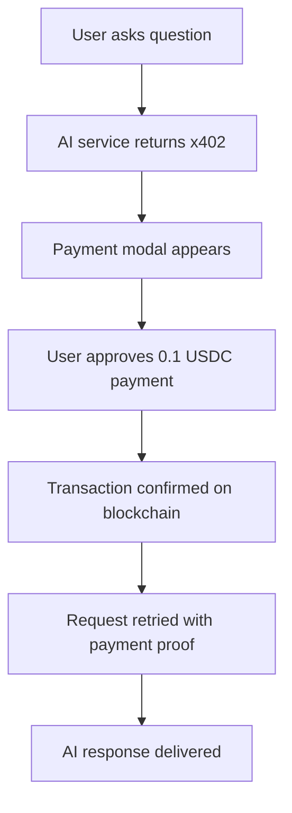
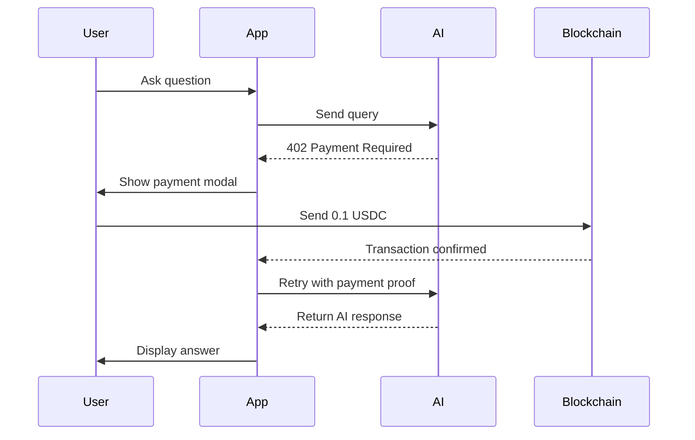

# MCP x402 Payment System

A Next.js application demonstrating **payment-gated AI interactions** using the x402 HTTP status code with real blockchain micropayments. Users pay **0.1 USDC** per AI query, showcasing how to monetize AI services with seamless Web3 payments.

## 🚀 What This App Does

This application demonstrates a **pay-per-use AI system** where:

1. **Users connect their wallet** (MetaMask, Coinbase CDP, or Smart Wallet with passkeys)
2. **Ask AI questions** through a chat interface
3. **Pay 0.1 USDC per query** automatically via blockchain transactions
4. **Receive AI-powered responses** after successful payment
5. **Interact with dynamic UI components** generated by AI

Perfect for developers wanting to build **monetized AI applications** with Web3 payments.

## ✨ Key Features

- 🔐 **Triple Wallet Support**: MetaMask, Coinbase CDP, or Smart Wallets with Passkeys
- 💳 **x402 Payment Gates**: HTTP 402 Payment Required implementation for API access
- 🔑 **Passkey Authentication**: Biometric login with Smart Wallets (most secure)
- 🤖 **Tambo AI Integration**: Generative UI with React component registry
- 🔗 **MCP Protocol Support**: Model Context Protocol for extensible AI functionality
- 🌐 **Base Network**: Supports both testnet (default) and mainnet
- 🛡️ **Production Ready**: Clean architecture with proper error handling
- 🎨 **Dynamic UI**: AI can generate and render React components on demand

## 🚀 Quick Start

### Prerequisites

- Node.js 18+ and npm
- A [Tambo AI API key](https://tambo.co/dashboard) (free tier available)
- A wallet address to receive payments

### Setup

1. **Clone and install**:

   ```bash
   git clone <your-repo-url>
   cd mcp-x402
   npm install
   ```

2. **Configure environment**:

   ```bash
   # Copy the example environment file
   cp example.env.local .env.local
   ```

3. **Add your API keys** to `.env.local`:

   ```env
   # Required: Get from https://tambo.co/dashboard
   NEXT_PUBLIC_TAMBO_API_KEY=your-tambo-api-key

   # Required: Your wallet address to receive payments
   NEXT_PUBLIC_PAYMENT_RECIPIENT=0x742d35Cc6634C0532925a3b8D4C9db96C4b4d8b6

   # Optional: Network mode (defaults to testnet for safety)
   NEXT_PUBLIC_NETWORK_MODE=testnet  # or 'mainnet' for production

   # Optional: CDP Wallet credentials (for enhanced wallet features)
   CDP_API_KEY_NAME=your-cdp-key-name
   CDP_API_KEY_PRIVATE_KEY=your-cdp-private-key
   CDP_PROJECT_ID=your-cdp-project-id
   CDP_WALLET_SECRET=your-cdp-wallet-secret
   CDP_PAYMASTER_SERVICE=your-paymaster-service-url
   ```

4. **Start the development server**:

   ```bash
   npm run dev
   ```

5. **Open your browser** to [http://localhost:3000](http://localhost:3000)

### First Steps

1. **Connect a wallet** (Smart Wallet with passkeys is recommended for new users)
2. **Ask a question** in the chat interface
3. **Confirm the 0.1 USDC payment** when prompted
4. **See your AI response** after successful payment!

## ⚙️ Configuration

### Environment Variables

This app uses a **security-first configuration approach**:

- **Secrets** (API keys, wallet addresses) → Environment variables
- **Non-secrets** (RPC URLs, contract addresses, gas settings) → `src/lib/config.ts`

#### Required Environment Variables

- `NEXT_PUBLIC_TAMBO_API_KEY`: Your Tambo AI API key ([Get one here](https://tambo.co/dashboard))
- `NEXT_PUBLIC_PAYMENT_RECIPIENT`: Wallet address that will receive the 0.1 USDC payments

#### Optional Environment Variables

- `NEXT_PUBLIC_NETWORK_MODE`: `testnet` (default) or `mainnet`
- CDP credentials for enhanced wallet features (see `example.env.local`)

### Network Configuration

The app automatically switches between networks based on `NEXT_PUBLIC_NETWORK_MODE`:

#### Testnet Mode (Default - Safe for Development)

- **Network**: Base Sepolia (Chain ID: 84532)
- **USDC Contract**: `0x036CbD53842c5426634e7929541eC2318f3dCF7e`
- **RPC URL**: `https://sepolia.base.org`
- **Features**: Free testnet tokens, no real money at risk

#### Mainnet Mode (Production)

- **Network**: Base Mainnet (Chain ID: 8453)
- **USDC Contract**: `0x833589fCD6eDb6E08f4c7C32D4f71b54bdA02913`
- **RPC URL**: `https://mainnet.base.org`
- **Features**: Real USDC transactions, production-ready

### Easy Network Switching

Change one environment variable to switch networks:

```env
# For development (safe, uses testnet)
NEXT_PUBLIC_NETWORK_MODE=testnet

# For production (real money!)
NEXT_PUBLIC_NETWORK_MODE=mainnet
```

All network-specific settings (RPC URLs, contract addresses, chain IDs) update automatically.

## 🔄 How It Works

### User Flow

1. **🔗 Connect Wallet**: Choose from Smart Wallet (passkeys), MetaMask, or Coinbase CDP
2. **💬 Ask Questions**: Type your question in the chat interface
3. **💳 Payment Prompt**: App shows payment modal for 0.1 USDC
4. **✅ Confirm Payment**: Approve the blockchain transaction
5. **🤖 AI Response**: Receive AI-generated answer with dynamic UI components
6. **🔄 Repeat**: Ask more questions, each requiring a new payment

### Payment Flow (x402 Implementation)



## 💼 Wallet Options

### 🔒 Smart Wallet with Passkeys (Recommended)

**Best for**: New users, maximum security

- ✅ **No setup required** - Wallet created automatically
- ✅ **Biometric authentication** - Use fingerprint, Face ID, or device passkeys
- ✅ **Most secure** - No seed phrases or private keys to manage
- ✅ **Instant setup** - Ready in seconds
- ✅ **Auto-configured** - Works on Base Sepolia out of the box

### 🦊 MetaMask

**Best for**: Existing MetaMask users

- 🔧 Install MetaMask browser extension
- 🌐 Add Base Sepolia network (Chain ID: 84532)
- 💧 Get testnet ETH from [Base Sepolia Faucet](https://www.alchemy.com/faucets/base-sepolia)
- 🪙 Get testnet USDC: Contract `0x036CbD53842c5426634e7929541eC2318f3dCF7e`

### 🏦 Coinbase CDP

**Best for**: Coinbase users, API-driven wallets

- ✅ **Automatic creation** - Wallets created via API
- ✅ **Auto-funding** - Testnet tokens provided automatically
- ✅ **No manual setup** - Everything handled programmatically

## 🏗️ Architecture

### Project Structure

```
src/
├── app/                    # Next.js App Router
│   ├── api/               # API routes for CDP wallet operations
│   ├── mcp-config/        # MCP server configuration page
│   └── page.tsx           # Main application page
├── components/            # React components
│   ├── ui/               # Reusable UI components
│   ├── WalletProvider.tsx # Multi-wallet context
│   ├── PaymentModal.tsx   # Payment confirmation UI
│   └── EnhancedMessageInput.tsx # Chat input with payment
├── lib/                   # Core business logic
│   ├── config.ts         # Configuration management
│   ├── payment.ts        # Universal payment handling
│   ├── smart-wallet.ts   # Smart wallet integration
│   ├── cdp-wallet.ts     # Coinbase CDP integration
│   ├── x402.ts           # HTTP 402 handling
│   └── tambo.ts          # AI component registry
└── styles/               # Global styles and Tailwind
```

### Core Systems

#### 💳 Payment System (`src/lib/payment.ts`)

- **Universal payment handling** for all wallet types
- **x402 integration** for payment-gated API calls
- **Transaction validation** and error handling
- **USDC transfers** on Base network

#### 🔐 Wallet Management

- **Smart Wallet** (`src/lib/smart-wallet.ts`): Passkey authentication
- **CDP Wallet** (`src/lib/cdp-wallet.ts`): Coinbase integration
- **Wallet Provider** (`src/components/WalletProvider.tsx`): Multi-wallet context

#### 🤖 AI Integration

- **Tambo AI**: React component registry for AI-driven UI
- **MCP Protocol**: Model Context Protocol for extensible AI
- **Dynamic Components**: AI generates and renders React components
- **Payment Gates**: x402 responses trigger payment flows

### API Routes

#### CDP Wallet Operations

- `POST /api/cdp/create-wallet` - Create new CDP wallet
- `POST /api/cdp/balance` - Check USDC balance
- `POST /api/cdp/transfer` - Execute USDC payments
- `POST /api/cdp/fund-wallet` - Fund wallet with testnet tokens
- `POST /api/paymaster` - Handle paymaster sponsorship

### Configuration System

#### Environment-Based Config (`src/lib/config.ts`)

- **Network switching**: Automatic testnet/mainnet configuration
- **Contract addresses**: Network-specific USDC contracts
- **RPC endpoints**: Reliable Base network connections
- **Gas settings**: Optimized transaction parameters

## 🛠️ Development

### Commands

```bash
# Development
npm run dev          # Start development server at localhost:3000
npm run build        # Build production application
npm run start        # Start production server
npm run lint         # Run ESLint for code linting

# Setup
npx tambo init       # Initialize Tambo configuration and create .env.local
```

### Development Workflow

1. **Fork the repository** and clone your fork
2. **Create a feature branch**: `git checkout -b feature/your-feature`
3. **Install dependencies**: `npm install`
4. **Set up environment**: Copy `example.env.local` to `.env.local`
5. **Start development**: `npm run dev`
6. **Make your changes** and test thoroughly
7. **Run linting**: `npm run lint`
8. **Build to verify**: `npm run build`
9. **Commit and push**: Follow conventional commit format
10. **Create a pull request** with detailed description

### Code Style

- **TypeScript**: Strict mode enabled
- **ESLint**: Configured for Next.js and React
- **Prettier**: Code formatting (run with `npm run format`)
- **Conventional Commits**: Use conventional commit format

## 🎨 Customization & Extension

### Adding AI-Controllable Components

The app uses a **component registry system** where AI can dynamically render React components. Here's how to add your own:

#### 1. Create Your Component

```tsx
// src/components/ui/my-component.tsx
import { z } from "zod";

export const myComponentSchema = z.object({
  title: z.string().describe("The component title"),
  data: z.array(z.string()).describe("Array of data items"),
});

export type MyComponentProps = z.infer<typeof myComponentSchema>;

export const MyComponent: React.FC<MyComponentProps> = ({ title, data }) => {
  return (
    <div className="p-4 border rounded">
      <h3 className="font-bold">{title}</h3>
      <ul>
        {data.map((item, index) => (
          <li key={index}>{item}</li>
        ))}
      </ul>
    </div>
  );
};
```

#### 2. Register with Tambo AI

```tsx
// src/lib/tambo.ts
import { MyComponent, myComponentSchema } from "@/components/ui/my-component";

export const components: TamboComponent[] = [
  // ... existing components
  {
    name: "MyComponent",
    description: "Displays a list of items with a title",
    component: MyComponent,
    propsSchema: myComponentSchema,
  },
];
```

#### 3. How It Works

1. **AI analyzes** user queries to determine which components to use
2. **Zod schemas** define the props structure for AI interaction
3. **AI generates** appropriate props based on the schema
4. **Components render** dynamically in the chat interface

### Customizing Payment Flow

#### Change Payment Amount

```tsx
// src/lib/config.ts
const APP_CONSTANTS = {
  // Change the default payment amount
  defaultPaymentAmount: '0.05', // Changed from 0.1 to 0.05 USDC
  // ... other constants
};
```

#### Modify Payment Logic

```tsx
// src/lib/payment.ts
export const createPaymentDetails = (
  recipient: string,
  amount: string = '0.1' // Change default amount here
): PaymentDetails => {
  // Custom payment logic
};
```

#### Customize Payment UI

```tsx
// src/components/PaymentModal.tsx
// Modify the payment confirmation modal
// Add custom styling, additional validation, etc.
```

### Adding New Wallet Types

#### 1. Create Wallet Service

```tsx
// src/lib/my-wallet.ts
export interface MyWalletService {
  connect(): Promise<WalletInfo>;
  getBalance(address: string): Promise<string>;
  transfer(recipient: string, amount: string): Promise<TransactionResult>;
}
```

#### 2. Integrate with WalletProvider

```tsx
// src/components/WalletProvider.tsx
// Add your wallet type to the provider context
// Implement connection and transaction logic
```

### MCP Server Configuration

#### Setting Up MCP Servers

1. **Navigate to** `/mcp-config` in your browser
2. **Add server configuration**:

   ```typescript
   {
     url: "https://your-mcp-server.com",
     transport: "http", // or "sse"
     name: "your-server-name",
     requiresPayment: true, // Enable x402 payments
     paymentAmount: "0.1" // Custom payment amount
   }
   ```

3. **Configure payment settings** for x402-enabled servers
4. **Settings persist** in browser localStorage

#### MCP Server Features

- **Payment gates**: Servers can require payments (x402) before processing
- **Automatic handling**: Tambo handles payment flows when x402 responses received
- **Multiple transports**: HTTP and Server-Sent Events (SSE) support
- **Custom tools**: Extend AI capabilities with external services

## 🧪 Testing

### Test Requirements

- **Testnet tokens**: ETH for gas, USDC for payments
- **Tambo API key**: Get from [tambo.co/dashboard](https://tambo.co/dashboard)
- **Browser**: Modern browser with Web3 support

### Test Scenarios

#### Core Payment Flow

1. **Smart Wallet (Recommended)**:
   - Create passkey → Ask question → Confirm payment → See AI response

2. **MetaMask**:
   - Connect MetaMask → Switch to Base Sepolia → Ask question → Pay → See response

3. **Coinbase CDP**:
   - Create CDP wallet → Ask question → Pay → See response

#### Edge Cases

4. **Insufficient Balance**: Test with insufficient USDC
5. **Payment Cancellation**: Cancel payment modal
6. **Network Errors**: Test with poor connectivity
7. **Invalid Recipient**: Test with invalid payment recipient
8. **MCP Integration**: Configure MCP servers → Test payment-gated queries

### Getting Testnet Tokens

#### Base Sepolia ETH (for gas)

- [Alchemy Base Sepolia Faucet](https://www.alchemy.com/faucets/base-sepolia)
- [Coinbase Faucet](https://www.coinbase.com/faucets/base-sepolia-faucet)

#### Base Sepolia USDC (for payments)

- Contract: `0x036CbD53842c5426634e7929541eC2318f3dCF7e`
- Use a testnet USDC faucet or bridge testnet ETH to USDC

## 🔧 Technical Details

### Wallet Architecture

#### Smart Wallet (Passkeys)

- **SDK**: Coinbase Wallet SDK
- **Authentication**: WebAuthn passkeys (biometric)
- **Security**: No private keys, device-based authentication
- **Network**: Base Sepolia/Mainnet

#### MetaMask Integration

- **Library**: wagmi + viem
- **Network**: Base Sepolia/Mainnet
- **Features**: Standard Web3 wallet connection

#### CDP Wallet

- **API**: Coinbase CDP SDK
- **Management**: Server-side wallet creation
- **Funding**: Automatic testnet funding

### x402 Payment Protocol



### Smart Contracts

#### USDC Contracts

**Testnet (Base Sepolia)**:

- **Address**: `0x036CbD53842c5426634e7929541eC2318f3dCF7e`
- **Chain ID**: 84532
- **Decimals**: 6

**Mainnet (Base)**:

- **Address**: `0x833589fCD6eDb6E08f4c7C32D4f71b54bdA02913`
- **Chain ID**: 8453
- **Decimals**: 6

### Network Configuration

The app automatically switches contracts and RPC endpoints based on `NEXT_PUBLIC_NETWORK_MODE`.

## 🔒 Security Considerations

### Network Safety

⚠️ **Defaults to testnet** for safety - no real money at risk

- **Testnet mode**: All payments use test tokens (no real value)
- **Mainnet mode**: Real USDC transactions - use with caution
- **Always verify** `NEXT_PUBLIC_NETWORK_MODE` before deployment

### Wallet Security

- **Smart Wallets**: Most secure - use passkeys, no private keys
- **MetaMask**: Never share private keys or seed phrases
- **CDP Wallets**: Server-managed, API-based security
- **Payment validation**: All transactions verified on-chain

## 🤝 Contributing

We welcome contributions! Here's how to get started:

### Quick Contribution Guide

1. **Fork** the repository
2. **Create** a feature branch: `git checkout -b feature/amazing-feature`
3. **Make** your changes
4. **Test** thoroughly (run `npm run build` and `npm run lint`)
5. **Commit** using conventional commits: `feat: add amazing feature`
6. **Push** to your fork: `git push origin feature/amazing-feature`
7. **Create** a Pull Request with detailed description

### What We're Looking For

- 🐛 **Bug fixes** and improvements
- ✨ **New AI components** for the registry
- 🔧 **Wallet integrations** (new wallet types)
- 📚 **Documentation** improvements
- 🧪 **Test coverage** enhancements
- 🎨 **UI/UX** improvements

### Development Guidelines

- **TypeScript**: Use strict typing
- **Testing**: Add tests for new features
- **Documentation**: Update README for new features
- **Code style**: Follow existing patterns
- **Commits**: Use conventional commit format

## 📚 Resources & Documentation

### Core Technologies

- **[Tambo AI](https://tambo.co)**: Generative UI framework with MCP support
- **[Tambo GitHub](https://github.com/tambo-ai/tambo)**: Component registry and MCP integration
- **[Next.js](https://nextjs.org)**: React framework for production
- **[Tailwind CSS](https://tailwindcss.com)**: Utility-first CSS framework

### Web3 & Blockchain

- **[Coinbase CDP](https://docs.cdp.coinbase.com)**: Coinbase Developer Platform
- **[Base Network](https://base.org)**: Ethereum L2 network
- **[wagmi](https://wagmi.sh)**: React hooks for Ethereum
- **[viem](https://viem.sh)**: TypeScript interface for Ethereum

### Protocols & Standards

- **[x402 Standard](https://tools.ietf.org/html/rfc7231#section-6.5.2)**: HTTP 402 Payment Required
- **[MCP Protocol](https://modelcontextprotocol.io)**: Model Context Protocol
- **[WebAuthn](https://webauthn.io)**: Web Authentication API (for passkeys)

## 🆘 Support & Troubleshooting

### Common Issues

#### "Payment recipient not configured"

- Set `NEXT_PUBLIC_PAYMENT_RECIPIENT` in `.env.local`
- Use a valid Ethereum address

#### "Tambo API key not found"

- Get API key from [tambo.co/dashboard](https://tambo.co/dashboard)
- Set `NEXT_PUBLIC_TAMBO_API_KEY` in `.env.local`

#### "Insufficient balance"

- Get testnet tokens from Base Sepolia faucets
- Ensure you have both ETH (gas) and USDC (payments)

#### "Network not supported"

- Check MetaMask is connected to Base Sepolia (Chain ID: 84532)
- Verify `NEXT_PUBLIC_NETWORK_MODE` setting

### Getting Help

- 📖 **Check the docs** above for detailed information
- 🐛 **Open an issue** for bugs or feature requests
- 💬 **Start a discussion** for questions or ideas
- 🔍 **Check console logs** for detailed error information

### Debug Mode

Enable debug logging by adding to `.env.local`:

```env
NEXT_PUBLIC_DEBUG=true
```

---

## 🚀 Ready to Build?

This project demonstrates the future of **monetized AI applications** with seamless Web3 payments. Fork it, customize it, and build the next generation of payment-gated AI services!

**Happy coding!** 🎉